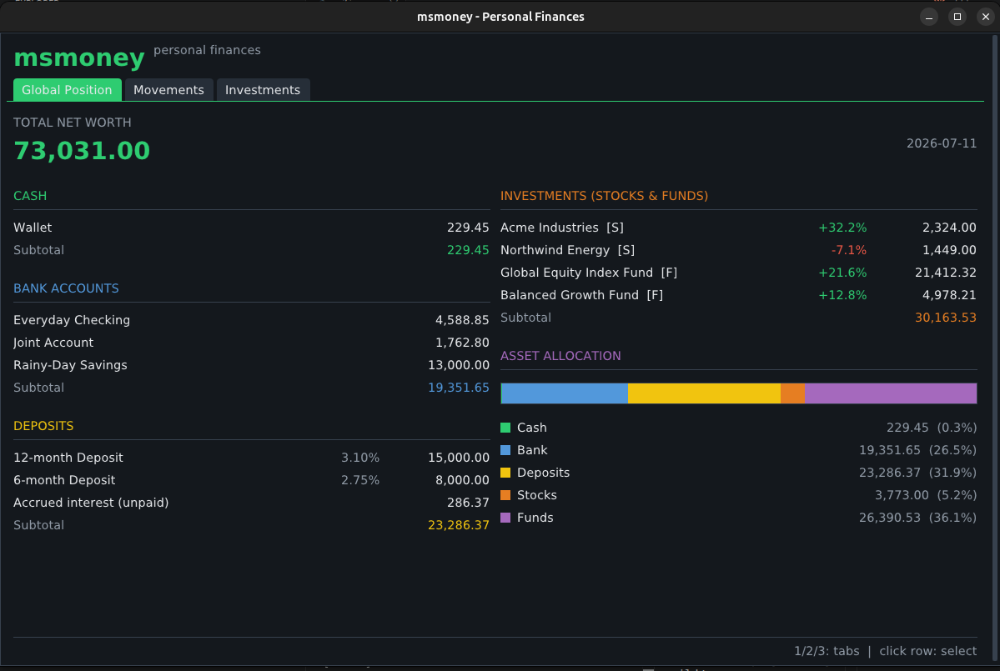

# msmoney

A small Microsoft Money-style personal finance manager written in C++17 with
SDL3 and Dear ImGui (vendored in `src/vendor/imgui`, using the SDL3 +
SDL_Renderer backends). Text uses the system DejaVu fonts when available,
falling back to ImGui's built-in font.



## Features

- **Global Position** — net worth at a glance: cash, bank accounts, deposits
  and investments with subtotals, plus an asset-allocation bar. Deposits show
  their interest rate and an "Accrued interest (unpaid)" line computed daily
  (simple interest, ACT/365) that counts toward the subtotal and net worth.
- **Movements** — per-account transaction register with running balance,
  add movements (income/expense) and delete them (red *x* per row, with
  confirmation), create new accounts (Cash / Bank / Deposit).
  Deposits have no movement register: selecting one shows a detail card with
  principal, rate, accrual start and accrued interest, plus an *Edit terms*
  button. When the bank actually pays the interest, record it as a movement
  on a bank account and move the deposit's accrual date forward.
- **Investments** — stocks and funds with a full trade history: every Buy/Sell
  is stored with its date, units and execution price. Units, average cost
  (average-cost method), realized P/L and unrealized gain are all computed
  from that history; selecting an asset shows its movements and per-sale
  realized P/L. No cash account is involved and the execution price does not
  touch the market price; the current price/NAV is set with *Update price*.
- **Timeline** — net-worth history built from snapshots. The global *Snapshot*
  button (top right, available from any tab) stores today's position — cash,
  bank, deposits (incl. accrued interest), stocks and funds — one snapshot per
  day, re-snapshotting the same day overwrites it. The tab charts every
  category plus the total over time (hover for exact figures) and lists all
  snapshots below, where they can be deleted.
- Accounts (including deposits) and assets can be deleted with their red
  *Delete* button; a confirmation dialog always asks first.
- Data is saved automatically to `msmoney.dat` (plain text) in the working
  directory, or to the path set in `config.ini` (see *Configuration*).
  Delete the file to start over with sample data.

## Build

```sh
cmake -B build -DCMAKE_BUILD_TYPE=Release
cmake --build build -j
./build/msmoney
```

Unit tests for the model layer (no SDL/ImGui needed):

```sh
ctest --test-dir build --output-on-failure
```

## Configuration

An optional `config.ini` in the working directory moves the data file
somewhere else (e.g. into a synced folder). Lines starting with `#` or `;`
are comments; `~/` expands to `$HOME`:

```ini
# where the data file lives (default: msmoney.dat in the working directory)
data = ~/Documents/msmoney.dat
```

## Controls

- `1` / `2` / `3` / `4` or the top tabs: switch view
- Click an account or asset row to select it
- Mouse wheel: scroll the movement list
- In dialogs: `Tab` next field, `Enter` accept, `Esc` cancel.
  Decimal comma or point are both accepted in numbers.

## File format

`msmoney.dat` is line-based, `|`-separated:

```
ACCOUNT|id|name|type|initial|rate|since   (type: 0 cash, 1 bank, 2 deposit;
                                           rate/since: deposit interest terms)
TX|accountId|date|description|amount
ASSET|id|name|type|units|avgPrice|price   (type: 0 stock, 1 fund)
ATX|assetId|date|units|price              (trade: units > 0 buy, < 0 sell)
SNAP|date|cash|bank|deposits|stocks|funds (Timeline snapshot, one per day)
```
